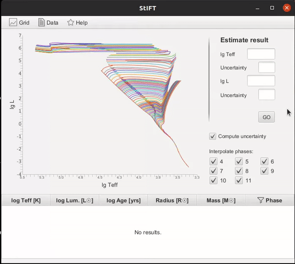

This section summarises the tool's options.

### Getting started

Head over to the Release section and get the [latest release](https://github.com/Johaney-s/StIFT/releases/latest).
To run the application, you only need to download the .jar file from there.

Ensure to have installed Java version 11 or newer. The application should run on Windows, MacOS and Linux.

## Graphical User Interface
To open the application the standard way, double click the .jar file or run  `java -jar stift.jar` from the command line.

### Input
Use one of the following ways of inputting the data:
- **Click the graph**, the (x, y) coordinates of cursor's position give input values.
- **Fill in the form** on the right.
- Upload **data file** via menu Data > Upload input data file.

The uncertainty is computed using 1000 estimations following the Monte Carlo simulations.
To turn off computing the uncertainty and speed the estimation up, uncheck the Compute uncertainty option.
Uncertainty that is equal to 0 is overwritten to uncertainty coming from points in evolutionary line.

To upload input data, provide a .txt file and comment out header lines with '#' symbol.
#TEMPERATURE | LUMINOSITY
--- | --- 
3.944 | 1.508
4.053 | 2.383
... and more

or

#TEMPERATURE | LUMINOSITY | TEMPuncertainty | LUMuncertainty
--- | --- | --- | --- 
3.944 | 1.508 | 0.014 | 0.023
4.053 | 2.383 | 0.008 | 0.027
... and more

attributes separated by space. Missing uncertainties attributes
will be set to 0.

### Grid (models)
To upload custom grid, navigate to menu Grid > Upload new grid.
Any header lines need to start with '#' sign to be parsed correctly.
Grid data need to be grouped by initial mass and sorted by evolutionary
phase. The GUI shows only a part of the grid data,
but all points are taken into account when computing.
Accepted format is a .txt file.
Use space or ',' delimiter between attributes. To obtain correct
uncertainty results, please follow the results table's header
for specification of values representation:

#Teff[lg K] | Lum[lg Lsun] | Age[dex yrs] | Rad[Rsun] | Mass[Msun] | Phase
--- | --- | --- | --- |--- |---
3.66943 | -0.72127 | 8.23306 | 10.66660 | 0.75000 | 5.00000
3.66932 | -0.72112 | 8.26683 | 10.66690 | 0.75000 | 5.00053
3.66922 | -0.72095 | 8.30172 | 10.66718 | 0.75000 | 5.00112
3.66912 | -0.72077 | 8.33767 | 10.66747 | 0.75000 | 5.00179
... and more

Default grid data is extracted from [CMD web interface](http://stev.oapd.inaf.it/cgi-bin/cmd).
Credit: PARSEC and COLIBRI tracks (Marigo et al. (2017)).

The **phase labels** in the default grid file are described [here](https://people.sissa.it/~sbressan/CAF09_V1.2S_M36_LT/readme.txt), StIFT uses these:
#Value | Phase | Description
--- | --- | ---
4 | NEAR_ZAM | This point is very near the ZAMS
5 | MS_BEG | H burning fully active
6 | POINT_B | Almost end of the H burning. Small contraction phase begins here for interm. & massive stars   
7 | POINT_C | Small contraction ends here and star move toward RG
8 | RG_BASE | RG base
9 | RG_BMP1 | RGB bump in Low Mass Stars (marked also for other masses)
10 | RG_BMP2 | RGB bump end in Low Mass Stars (marked also for other masses)
11 | RG_TIP | Helium Flash or beginning of HELIUM Burning in intermediate and massive stars

### Filtering
For filtering the results in the table, use phase filter in the phase column header.
Results filtered out won't appear in the export file.

For ignoring certain phases in the interpolation, restrict them
using checkboxes. Keep in mind that the result can be estimated
in the phase that is filtered out (for example if phase 6 is ignored
but phases 5 and 7 are chosen as the nearest tracks).

### Exporting
To export results that appear in the results table, use menu Data > Export data.
In the export file, you will find estimated parameters together with their uncertainties and estimation method.

There are different estimation methods that could have been applied to estimate mean values - NONE means no method could resolve the parameters, STAR MATCH means the input point is too close to some of the points in the grid and therefore it copies this grid point's values. SIDE MATCH only implies that the point lies too close to a side of the 4-angled figure and was interpolated using only 2 of the neighbours. FULL ESTIMATION suggests the standard process of estimating was followed - all 4 neighbours were repetitively interpolated. ZAMS INSIDER means additional point had to be estimated along the ZAMS track before continuing to the standard estimation method - simply because no lower right neighbour was found in the grid. ZAMS OUTSIDER means that the point lies outside of the graph, but the input values' uncertainties hit inside the graph.

## Text mode
Text mode serves mainly as a debugging tool as it prints intermediate results of the computation. This includes the neighbours used for estimation, evolutionary line, mean value and uncertainties. You can use it from the command line with command

`java -jar file_name.jar text TEMP LUM [TEMPunc LUMunc] [GRID_FILE]`

where TEMP and LUM are input values of effective temperature and luminosity and optional arguments TEMPunc, LUMunc their uncertainties. Missing uncertainties are treated as 0.
Missing grid file argument instructs the application to use the default grid.

## Fast mode
Fast mode can be used for limited, but fully run from command line, computation. This mode processes input file and directly exports result.
The command to run fast mode is following:

`java -jar file_name.jar fast INPUT_FILE [GRID_FILE] EXPORT_FILE_NAME`

where grid file is optional argument and if missing,
default grid is used.

