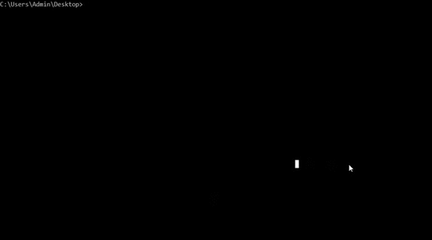

This section summarises the tool's options.

### Getting started

Head over to the Release section and get the [latest release](https://github.com/Johaney-s/StIFT/releases/latest).
To run the application, you only need to download the .jar file from there.

Ensure to have installed Java version 11 or newer. The application should run on Windows, MacOS and Linux.

## Graphical User Interface
To open the application the standard way, double click the .jar file or run  `java -jar stift.jar` from the command line.

### Input
Use one of the following ways of inputting the data:
- **Click the graph**, the (x, y) coordinates of cursor's position give input values.
- **Fill in the form** on the right.
- Upload **data file** via menu Data > Upload input data file.

The uncertainty is computed using 1000 estimations following the Monte Carlo simulations.
To turn off computing the uncertainty and speed the estimation up, uncheck the Compute uncertainty option.
Uncertainty that is equal to 0 is overwritten to uncertainty coming from points in evolutionary line.

To upload input data, provide a .txt file and comment out header lines with '#' symbol.
#TEMPERATURE | LUMINOSITY
--- | --- 
3.944 | 1.508
4.053 | 2.383
...

or

#TEMPERATURE | LUMINOSITY | TEMPuncertainty | LUMuncertainty
--- | --- | --- | --- 
3.944 | 1.508 | 0.014 | 0.023
4.053 | 2.383 | 0.008 | 0.027
...

attributes separated by space. Missing uncertainties attributes
will be set to 0.

### Grid (models)
To upload custom grid, navigate to menu Grid > Upload new grid.
Any header lines need to start with '#' sign to be parsed correctly.
Grid data need to be grouped by initial mass and sorted by evolutionary
phase. The GUI shows only a part of the grid data,
but all points are taken into account when computing.
Accepted format is a .txt file.
Use space or ',' delimiter between attributes. To obtain correct
uncertainty results, please follow the results table's header
for specification of values representation:

#Teff[lg K] | Lum[lg Lsun] | Age[dex yrs] | Rad[Rsun] | Mass[Msun] | Phase
--- | --- | --- | --- |--- |---
3.66943 | -0.72127 | 8.23306 | 10.66660 | 0.75000 | 5.00000
3.66932 | -0.72112 | 8.26683 | 10.66690 | 0.75000 | 5.00053
3.66922 | -0.72095 | 8.30172 | 10.66718 | 0.75000 | 5.00112
3.66912 | -0.72077 | 8.33767 | 10.66747 | 0.75000 | 5.00179
...

Default grid data is extracted from [CMD web interface](http://stev.oapd.inaf.it/cgi-bin/cmd).
Credit: PARSEC and COLIBRI tracks (Marigo et al. (2017)).

### Filtering
For filtering the results in the table, use phase filter in the phase column header.
Results filtered out won't appear in the export file.

For ignoring certain phases in the interpolation, restrict them
using checkboxes. Keep in mind that the result can be estimated
in the phase that is filtered out (for example if phase 6 is ignored
but phases 5 and 7 are chosen as the nearest tracks).

### Exporting
To export results that appear in the results table, use menu Data > Export data.

## Text mode
Text mode serves mainly as a debugging tool, but you can use it from the command line with `java -jar file_name.jar text TEMP LUM [TEMPunc LUMunc] [GRID_FILE]`
where TEMP and LUM are input values of effective temperature and luminosity and optional arguments TEMPunc, LUMunc their uncertainties. Missing uncertainties are treated as 0.
Missing grid file argument instructs the application to use the default grid.

## Fast mode
Fast mode can be used for limited, but fully run from command line, computation.
The command to run fast mode is following: `java -jar file_name.jar fast INPUT_FILE [GRID_FILE] EXPORT_FILE_NAME` where grid file is optional argument and if missing,
default grid is used.

